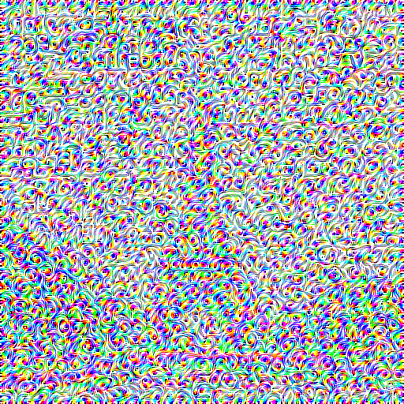

# Neural Style Transfer Web App

This project is a **full-stack web application** for applying artistic style transfer to images.  
Users can upload a **content image** and a **style image**, and the backend will generate a new image with the style applied to the content.

---

## 📜 Project Journey

Initially, I implemented **Neural Style Transfer** using the **VGG-19 optimization-based approach**.  
While this method is academically popular and produces high-quality results in research settings, in practice it had two major drawbacks:

1. **Extremely Slow Output Generation**  
   - Required running optimization for multiple epochs and steps per epoch.  
   - Even with reduced parameters (e.g., 5 epochs, 50 steps per epoch), output time was still high (tens of seconds to minutes per image).  

2. **Poor Visual Results for Quick Runs**  
   - Reducing training time to speed up the process caused noisy and heavily distorted outputs.  
   Example result from the **VGG approach** (quick run):  
   <table>
  <tr>
    <td align="center"></td>
    <td align="center"></td>
    <td align="center"></td>
  </tr>
  <tr>
    <td align="center">Content Image</td>
    <td align="center">Style Image</td>
    <td align="center">Styled Output</td>
  </tr>
</table>
Because of this, I decided to switch to a **Feed-Forward Pre-Trained Model**.

---

## 🚀 Feed-Forward Model Approach

The new implementation uses a **pre-trained TensorFlow Hub model**:

- Model: [`magenta/arbitrary-image-stylization-v1-256`](https://tfhub.dev/google/magenta/arbitrary-image-stylization-v1-256/2)
- Advantage:
  - **Real-time inference** (1–2 seconds per image on CPU, faster on GPU)
  - No need for iterative optimization
  - Consistently produces better and cleaner results compared to quick VGG runs

---

## 🛠 Tech Stack

**Frontend**
- React (with Tailwind CSS for styling)
- Simple file upload UI for content & style images

**Backend**
- Flask (Python)
- TensorFlow + TensorFlow Hub
- Pillow for image handling

---

## ⚡ Running the Project for Development

1. **Backend Setup**
   ```bash
   cd backend
   python -m venv .venv
   source .venv/bin/activate   # Windows: .venv\Scripts\activate
   pip install -r requirements.txt
   python app.py

2. **Frontend Setup**
   ```bash
   cd frontend
   npm install
   npm run dev
   
## ⚡ Running the Project for Production
1. 1. **Setting up the render app for Backend deployment**
  - Search for the backend repository with the same name
  - https://neural-style-transfer-backend.onrender.com
   
2. **Frontend is deployed on Vercel app**
   https://neural-style-transfer-two.vercel.app/
- Open the frontend in your browser.
- Upload a content image and a style image.
- Wait for processing (~1–2 seconds).
- Download the styled output.

- Note: Didn't work much on the frontend UI because the sole purpose of the project is to learn about TF model and perform neural style transfer and also learn how to deploy it

---

Some Output Pictures Obtained:

